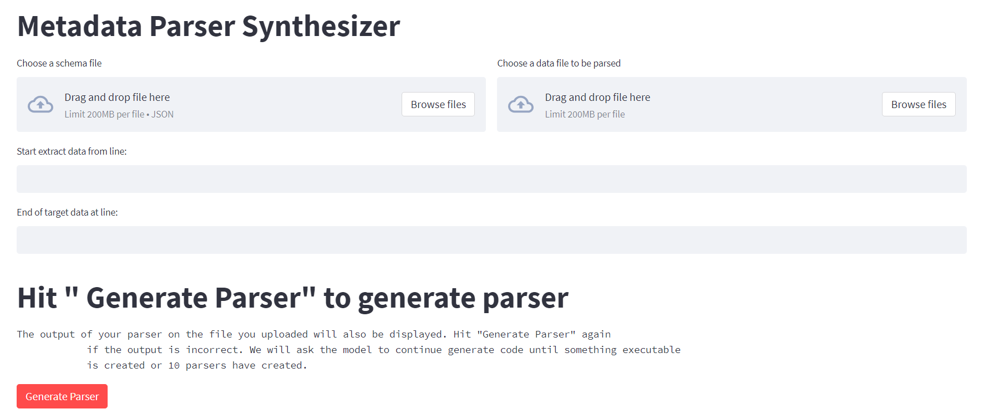

# ParserGenerator
This is a small tool that tries to automate writing parsers in python for raw data files with the help of GPT3.5. Currently, it works on CSV files.

# How to run the code
- Make sure Python and pip is installed in your machine (Python 3.10.6 and pip 22.0.2 is used for development)
- Install streamlit with the following command

        pip install streamlit

- check if the installation is successful by running the following command

        streamlit hello

- In the directory that has 'frontend.py' run 

        streamlit run frontend.py
  Now you should see the interface
  
  
# How to use the tool 
- Write an example json output you wish to have in `my_output.json`
- Then run `streamlit run frontend.py` to open the frontend
- Upload the a raw data file and a schema file about the json object you want to get
- Specify between which lines are the meta data (GPT3.5 cannot read the entire raw data file)
- Hit "Generate Parser" and code generation will run until something executable is generated or 10 code files have been created.

# Example execution result
  
